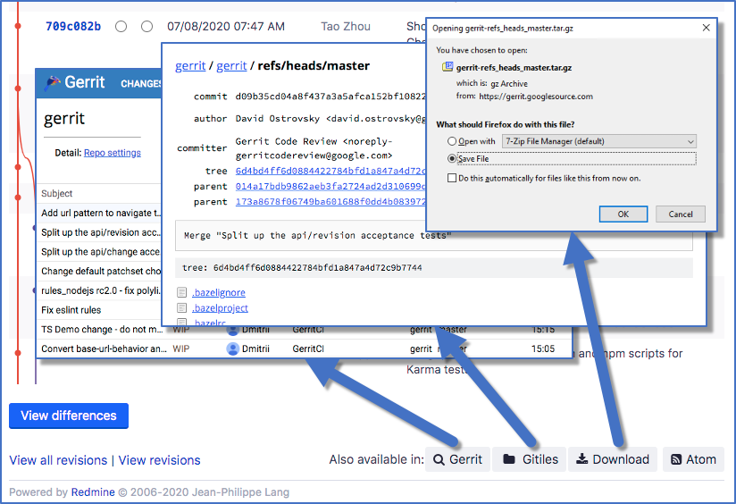

# Redmine Gerrit Connector Plugin
Extend [Redmine](https://redmine.org/) revision and issue views with links to [Gerrit](https://gerritcodereview.com/) and the [Gitiles](https://gerrit.googlesource.com/gitiles/) repository browser.

[](docs/revision.png)

This plugin targets a setup where Gerrit hosts the Git repositories and replicates them to Redmine to benefit from the Redmine issue-revision linking and the Redmine repository browser. It adds links on Redmine back to Gerrit to search for associated changes. Additionally, since both Gitiles and the Redmine repository browser offer functionalities missing from the other, the plugin add links to Gitiles, e.g., to download a repository revision.

The links are realized as additional buttons in the 'Also available in' sections on the corresponding page.


The plugin adds the following links to the Redmine repository view (cf. screenshot):
* _Gerrit_: List repository changes on Gerrit
* _Gitiles_: Browse revision in Gitiles
* _Download_: Download .tar.gz from Gitiles

The buttons are only shown for repositories relative to the configured base directory of local GIT repositories in the plugin configuration.

The plugin adds the following link to the issue view (without checking beforehand if any associated changes exist) :
* _Gerrit_: Search for associated changes on Gerrit


## Requirements
The plugin has been tested on Redmine 3.3 and 4.1 but should work on versions in between and may work on earlier or later versions as well.

It requires Ruby 2.0 or newer.

Finally, it depends on the [Redmine Base Deface](https://www.redmine.org/plugins/redmine_base_deface) plugin.


## Installation
The [general plugin installation instructions](https://www.redmine.org/projects/redmine/wiki/Plugins) apply as this plugin does not require any special handling and does not use the database.

Install the [Redmine Base Deface](https://www.redmine.org/plugins/redmine_base_deface) plugin and clone this repository to `gerrit_connector` in the `plugins` directory of the Redmine installation (the local directory name is important).

In short, execute the following from the Redmine root directory:
```shell script
[ -d plugins/redmine_base_deface ] || git clone https://github.com/jbbarth/redmine_base_deface.git plugins/redmine_base_deface
git clone https://github.com/isotes/redmine-gerrit-connector plugins/gerrit_connector
bundle install
bundle exec rake redmine:plugins RAILS_ENV=production
```

## Plugin Configuration
It is necessary to specify certain settings such as the Gerrit URL in the plugin configuration. Furthermore, it is possible to hide any button and to specify the CSS classes for styling.


## Gerrit Configuration
While no configuration on Gerrit is necessary for this plugin, the following provides some hints which might provide a smoother experience.

If the repositories on Gerrit are not public and the user is not logged in, both Gerrit and Gitiles provide less-than-helpful error messages when accessed via a deep link, for example browsing a specific repository, as used by this plugin. The Gerrit plugin [login-redirect](https://www.gerritcodereview.com/plugins.html) automatically redirects to the login page in these cases. It can be simply installed from the Gerrit web interface and does not require and configuration.

For mirroring the Gerrit repositories to Redmine, we successfully used the Gerrit plugin [replication](https://www.gerritcodereview.com/plugins.html), which can automatically push updates in the repositories via SSH to other hosts. On Redmine, we then configure a project repository from the local directory of the replicated repository.


## License
[MIT](LICENSE)
